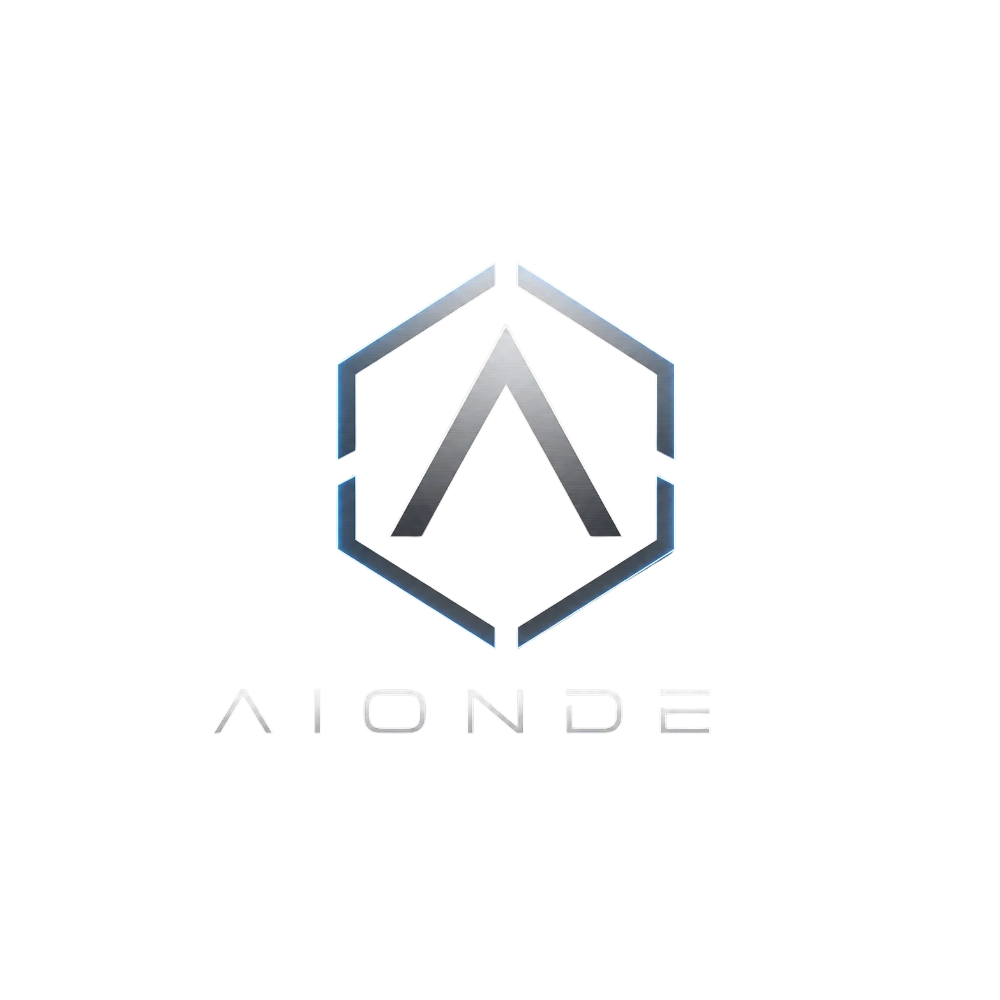

  

  <strong>Tecnología construida para perdurar</strong>

  Ingeniería de Software • Cloud • DevOps • IA • Arquitectura Empresarial

---

## Quiénes Somos

AionDex es una empresa de ingeniería de software especializada en el diseño, desarrollo e implementación de soluciones tecnológicas modernas, escalables y seguras.

Creamos plataformas web, aplicaciones empresariales, APIs, infraestructura cloud, soluciones móviles y ecosistemas digitales que permiten a organizaciones públicas y privadas acelerar su transformación digital.

---

## Tecnologías

### Frontend

### Backend

### Bases de Datos

### Cloud & DevOps

### Mobile

### Testing

  
  
  
  
  
  
  

### Herramientas

---

## Servicios

### Desarrollo de Software

- Sistemas Empresariales
- Aplicaciones Web
- Plataformas SaaS
- Portales Institucionales
- Automatización de Procesos
- Integraciones Empresariales

### Infraestructura

- Docker
- Kubernetes
- Linux Servers
- CI/CD
- Cloud Computing
- Monitoreo y Observabilidad

### Consultoría

- Arquitectura de Software
- Transformación Digital
- Auditoría Técnica
- Modernización de Sistemas
- Optimización de Procesos

---

## Industrias

- Gobierno
- Salud
- Educación
- Recursos Humanos
- Finanzas
- Comercio Electrónico
- Logística
- Telecomunicaciones
- Startups

---

## Conecta con AionDex

<table align="center">
<tr>
<td align="center">

</td>

<td align="center">

</td>

<td align="center">

</td>

<td align="center">

</td>

<td align="center">

</td>

<td align="center">

</td>

<td align="center">

</td>
</tr>
</table>

---

<strong>AionDex</strong> 
Tecnología construida para perdurar

